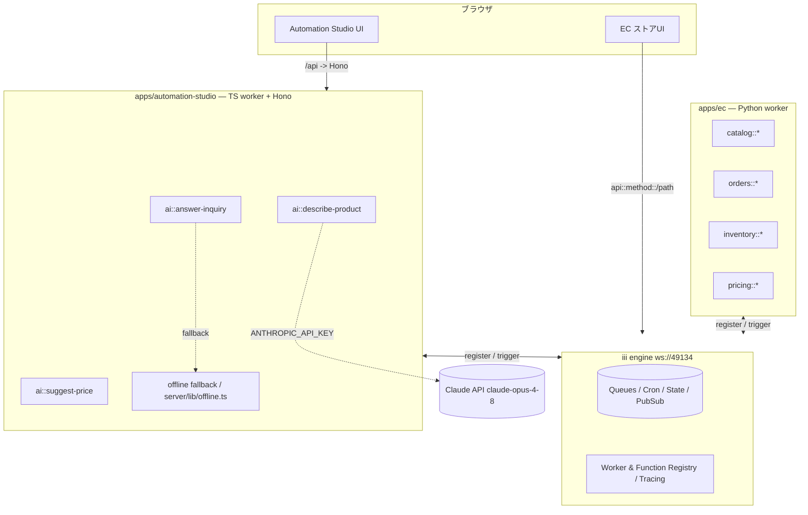
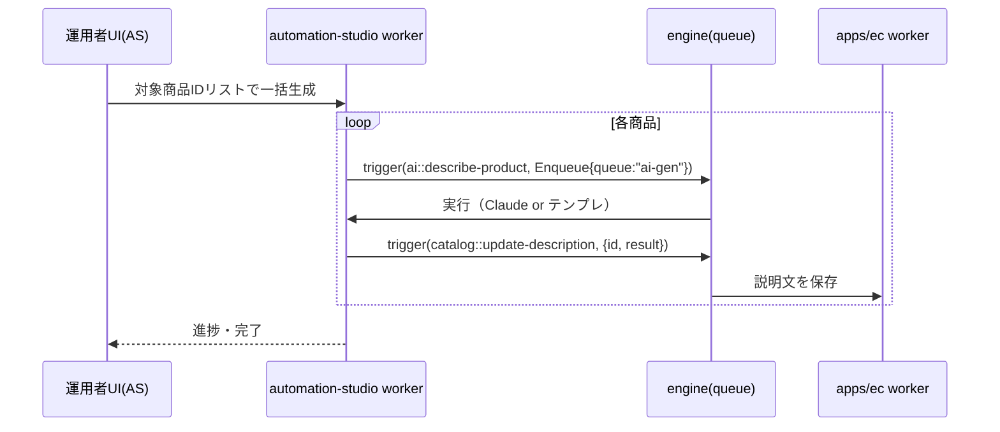
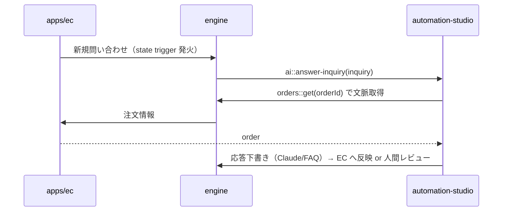

# 統合アーキテクチャ設計: EC(couxo9) × Automation Studio

> 目的: 転売EC本体（`himitsuomom/EC` の `couxo9` ブランチ, **Python**）と、本リポジトリの
> `apps/automation-studio`（AI業務自動化, **TypeScript**）を **1つのモノレポに統合**するための設計。
>
> インタラクティブ版は同ディレクトリの **`index.html`** をブラウザで開いてください（タブ切替・図・進捗チェックリスト）。

## 1. 背景と制約

- ホスト `iii-anime` は **orchestration / 連携基盤**（worker が `namespace::function` と trigger を登録し、エンジン経由で
  TS/Python/Rust/Go を1システムに繋ぐ）。これを**統合バックボーン**に使うのが最も自然。
- `couxo9`/EC は別リポ・**private・Python**で、設計時点では**内部実装を参照できない**。
  → 本設計は **コントラクト中心（contract-first）**。EC のフレームワーク（Django/FastAPI/Flask 等＝未確認）を作り替えず、
  **薄いアダプタで iii worker 化**することで、実装が判明しても差分を `apps/ec` のアダプタ層に局所化する。

## 2. 全体方針

1. **モノレポ統合**: EC(Python) と Automation Studio(TS) を1リポジトリに同居。
2. **疎結合連携**: 両者を **iii worker** として登録し、エンジン（`ws://localhost:49134`）経由の
   **JSON over WebSocket** で相互呼び出し。同期 `trigger()` / 非同期 `TriggerAction.Enqueue({queue})` / 投げっぱなし `Void()`。
3. **単一の真実 = `packages/contracts`**: JSON Schema を正本に、TS型（`json-schema-to-typescript`）と
   Python（Pydantic, `datamodel-code-generator`）を**自動生成**して両言語で共有。

## 3. ターゲット構成

```
iii-anime/ (monorepo)
├─ engine/                         # iii ランタイム（既存）
├─ apps/
│  ├─ ec/                          # ★ EC本体(Python)= couxo9。既存サービス層 + 薄いiii workerアダプタ
│  └─ automation-studio/           # 既存(TS)。UI(Vite/React)+Honoサーバ + iii worker(ai::*)
├─ packages/
│  └─ contracts/                   # ★ 新規。JSON Schema → TS型 & Pydanticモデル（統合境界）
└─ sdk/packages/{node,python}/iii  # 両appが使う既存SDK
```

## 4. コンポーネント図



## 5. 統合API（関数コントラクト）

エンジン上の関数IDは `namespace::function`（グローバル一意・worker非依存）。これが**サービス間の契約**。

| 提供元 | 関数ID | 入力 → 出力（契約） |
|---|---|---|
| apps/ec | `catalog::get` | `{id}` → `Product` |
| apps/ec | `catalog::list` | `{cursor?,limit?}` → `{items: Product[], nextCursor?}` |
| apps/ec | `catalog::update-description` | `{id, description: GeneratedDescription}` → `{ok}` |
| apps/ec | `orders::get` | `{id}` → `Order` |
| apps/ec | `orders::stats` | `{period}` → `OrderStats`（KPI用） |
| apps/ec | `inventory::alerts` | `{}` → `InventoryAlert[]` |
| apps/ec | `inventory::sync` | `{sku}` → `InventoryItem` |
| apps/ec | `pricing::context` | `{sku}` → `PricingContext`（原価・手数料等） |
| automation-studio | `ai::describe-product` | `DescribeRequest` → `GeneratedDescription`（キー無→テンプレ） |
| automation-studio | `ai::answer-inquiry` | `Inquiry` → `{reply, source}`（キー無→FAQ） |
| automation-studio | `ai::suggest-price` | `{sku}` → `PriceQuote`（`pricing::context`を消費） |

> `ai::*` は `apps/automation-studio/server/lib/offline.ts` の純ロジックを**そのまま再利用**（キー無しでも稼働）。

## 6. 主要シーケンス

### ① 商品説明の一括生成（非同期キュー）



### ② 問い合わせ自動応答（state / イベント駆動）



### ③ KPIダッシュボードの実データ化

`apps/automation-studio/src/components/Dashboard.tsx` の `KPIS` 定数（現在モック）を、
`orders::stats` / `inventory::alerts` の `trigger()` 取得に置換する。

## 7. 横断的関心事

| 観点 | 方針 |
|---|---|
| 機密 | `ANTHROPIC_API_KEY` は **automation-studio worker のみ**保持。ブラウザ/ECには渡さない（既存方針踏襲）。 |
| 認証 | worker↔engine はプライベートNW + `InitOptions.headers` のトークン。ブラウザ→HTTPトリガーは EC既存のセッション認証。 |
| 観測性 | iii は OpenTelemetry 内蔵（`traceparent` 伝播）。`sdk/packages/{node,python}/observability` を両appで利用。 |
| 退行耐性 | AI機能はキー無しでも `offline.ts` のテンプレ/FAQで動作。EC不通時は AS 側で graceful degrade。 |
| 契約バージョン | `contracts@MAJOR` 固定・追加的変更を基本。破壊的変更は新ネームスペース（例 `catalog::v2::get`）。 |

## 8. モノレポ build / CI / deploy 統合（実構成準拠）

- **EC(Python)** `apps/ec/`: hatchling + `uv.lock`（既存 `sdk/packages/python/iii` と同形）。ruff/mypy strict・line 120。
  - `Makefile` に `lint-ec-python` / `typecheck-ec-python` / `test-ec-python`（`III_URL` 注入）を追加。
  - `.github/workflows/ci.yml` に `ec-python-ci`（matrix 3.10–3.12 / `engine-build`成果物 → `scripts/start-iii.sh` 起動 → pytest）。
- **automation-studio(TS)**: 既存 pnpm/turbo。`iii-sdk` を `workspace:*` 依存に追加して worker 化。
- **contracts**: JSON Schema → 生成。TS型は turbo `build`（`^build` で AS が消費）、Python(Pydantic) は Makefile の codegen。
- **deploy**: engine は既存 `engine/Dockerfile`（distroless）。EC worker=Python slim+uv / AS=node をコンテナ化、
  `engine/docker-compose.yml` をローカル拡張。prod は `infra/terraform/{ec,automation-studio}` + `deploy-*.yml`（OIDC, `deploy-website.yml`に倣う）。

## 9. 段階的ロードマップ

- **Phase 0 — EC をスコープに取り込む（現状ブロッカー）**: 本セッションは `iii-anime` のみアクセス可、`add_repo` 系ツールも無い。
  EC用にリポジトリ・スコープを追加するか、両リポを含む新セッションが必要。完了まで contracts は仮定値で設計し後で差し替え。
- **Phase 1 — `packages/contracts`**: 代表エンティティを JSON Schema 化＋TS/Pydantic 生成（本リポに雛形あり）。挙動変更なし。
- **Phase 2 — EC を iii worker 化**: 既存サービス層/HTTP API を薄くラップし `catalog/orders/inventory/pricing::*` を登録。
- **Phase 3 — AS を iii worker 化**: `ai::*` を公開。Dashboard のモック値を実データに置換。
- **Phase 4 — 非同期フロー**: 一括説明生成・問い合わせ自動応答をキュー/stateトリガーで配線。トレース有効化。
- **Phase 5 — CI/deploy 統合**: Makefile/turbo/CI 拡張、コンテナ＆Terraform でデプロイ一本化。

## 10. 未確定事項

- couxo9 の実スタック（FW/DB/認証）は Phase 2 着手時に確定。コントラクトは仮置き。
- 「統合の物理形態」（EC を `iii-anime` に取り込む / EC 側へ集約）は Phase 0 のスコープ解決時に最終決定。

---

関連: 契約スキーマの雛形は `packages/contracts/`（リポジトリルート）にあります。
