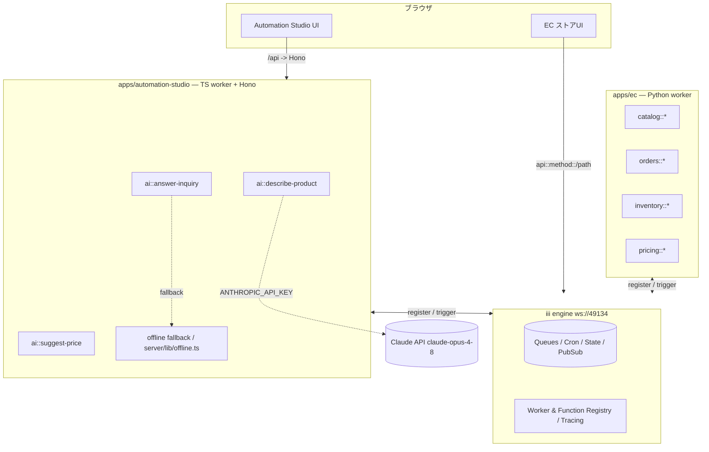
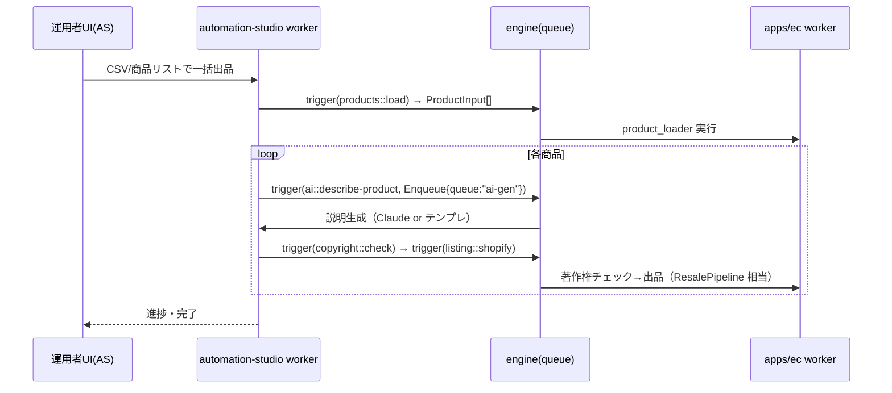
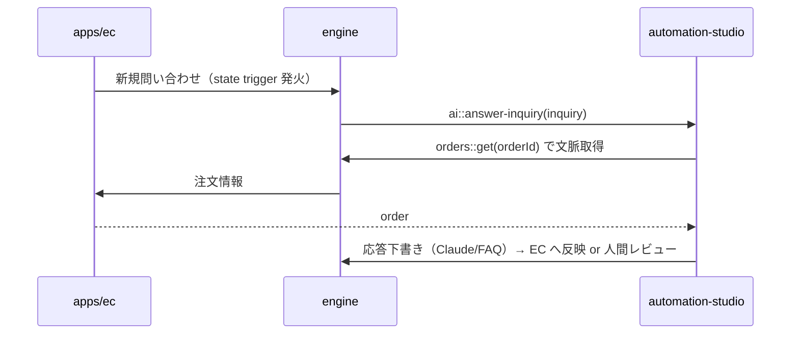

# 統合アーキテクチャ設計: EC(couxo9) × Automation Studio

> 目的: 転売EC本体（`himitsuomom/EC` の `couxo9` ブランチ, **Python**）と、本リポジトリの
> `apps/automation-studio`（AI業務自動化, **TypeScript**）を **1つのモノレポに統合**するための設計。
>
> インタラクティブ版は同ディレクトリの **`index.html`** をブラウザで開いてください（タブ切替・図・進捗チェックリスト）。

## 1. 背景と制約

- ホスト `iii-anime` は **orchestration / 連携基盤**（worker が `namespace::function` と trigger を登録し、エンジン経由で
  TS/Python/Rust/Go を1システムに繋ぐ）。これを**統合バックボーン**に使うのが最も自然。
- **2026-06 更新**: GitHub import が認証で失敗したため EC ソースを zip で受領し、**`apps/ec/` に取り込み済み**。
  実体は **POD転売自動化パイプライン（Python 3.11, CLIバッチ）**であることが判明（下記 §11）。Web ストアフロントではない。
  → 本設計は引き続き **コントラクト中心（contract-first）**。EC を作り替えず、**薄いアダプタで iii worker 化**して差分を局所化する。

## 2. 全体方針

1. **モノレポ統合**: EC(Python) と Automation Studio(TS) を1リポジトリに同居。
2. **疎結合連携**: 両者を **iii worker** として登録し、エンジン（`ws://localhost:49134`）経由の
   **JSON over WebSocket** で相互呼び出し。同期 `trigger()` / 非同期 `TriggerAction.Enqueue({queue})` / 投げっぱなし `Void()`。
3. **単一の真実 = `packages/contracts`**: JSON Schema を正本に、TS型（`json-schema-to-typescript`）と
   Python（Pydantic, `datamodel-code-generator`）を**自動生成**して両言語で共有。

## 3. ターゲット構成

```
iii-anime/ (monorepo)
├─ engine/                         # iii ランタイム（既存）
├─ apps/
│  ├─ ec/                          # ★ EC本体(Python)= couxo9。既存サービス層 + 薄いiii workerアダプタ
│  └─ automation-studio/           # 既存(TS)。UI(Vite/React)+Honoサーバ + iii worker(ai::*)
├─ packages/
│  └─ contracts/                   # ★ 新規。JSON Schema → TS型 & Pydanticモデル（統合境界）
└─ sdk/packages/{node,python}/iii  # 両appが使う既存SDK
```

## 4. コンポーネント図



## 5. 統合API（関数コントラクト）

エンジン上の関数IDは `namespace::function`（グローバル一意・worker非依存）。これが**サービス間の契約**。

関数IDは取り込んだ EC の**実モジュール**に対応付ける（下表）。

| 提供元 | 関数ID | 実モジュール（apps/ec） | 入力 → 出力 |
|---|---|---|---|
| apps/ec | `products::load` | `src/io/product_loader.py` | source(CSV等) → `ProductInput[]` |
| apps/ec | `products::describe` | `src/product/generator.py` (`ProductGenerator`) | `ProductInput` → `ProductListing` |
| apps/ec | `copyright::check` | `src/product/copyright_checker.py` | `{design_concept, name}` → `CopyrightCheckResult` |
| apps/ec | `listing::shopify` / `listing::mercari` / `listing::podtomatic` | `src/listing/*.py` | `ProductListing` → 出品結果 |
| apps/ec | `analytics::price` / `analytics::demand` | `src/analytics/{price_tracker,demand_analyzer}.py` | `{sku/keyword}` → 分析結果 |
| apps/ec | `pipeline::run` | `src/pipeline.py` (`ResalePipeline`) | `ProductInput` → `PipelineResult`（著作権→生成→出品） |
| apps/ec | `pipeline::run-batch` / `pipeline::status` | `src/worker/orchestration.py` | `{products[]}` → `{batch_id}` / `{batch_id}` → 進捗（queue＋state） |
| apps/ec | `pipeline::run-tracked` | `src/worker/orchestration.py` | （queue 専用・内部）`ProductInput` → 実行＋state 記録 |
| automation-studio | `ai::describe-product` | `server/lib/describe.ts`（+ `iii-worker.ts`）/ Claude opus | `{productName,features,keywords,tone}` → `{title,description,bullets,seoKeywords,source}`（キー無→テンプレ） |
| automation-studio | `ai::answer-inquiry` | `server/lib/inquiry.ts`（+ `iii-worker.ts`）/ Claude opus | `{messages}` → `{reply, source}`（キー無→FAQ） |

> **重複の整合 … ✅ 一本化済み（Phase B）**: EC の説明生成は `src/worker/remote.py` の
> `RemoteProductGenerator` で automation-studio の `ai::describe-product`（`claude-opus-4-8`）へ委譲する。
> **デフォルト remote ＋ ローカル退避**: エンジン未接続/失敗時は EC のローカル（`ProductGenerator`）/
> オフライン生成へ自動フォールバックするため、EC 単体でも稼働する（`EC_DESCRIBE_BACKEND=local` で固定可）。
> `ai::*` は `server/lib/{describe,inquiry}.ts` の純ロジックを HTTP ルートと共有（キー無しでも稼働）。

## 6. 主要シーケンス

### ① 商品説明の一括生成（非同期キュー）



### ② 問い合わせ自動応答（state / イベント駆動）



### ③ KPIダッシュボードの実データ化

`apps/automation-studio/src/components/Dashboard.tsx` の `KPIS` 定数（現在モック）を、
`orders::stats` / `inventory::alerts` の `trigger()` 取得に置換する。

## 7. 横断的関心事

| 観点 | 方針 |
|---|---|
| 機密 | `ANTHROPIC_API_KEY` は **automation-studio worker のみ**保持。ブラウザ/ECには渡さない（既存方針踏襲）。 |
| 認証 | worker↔engine はプライベートNW + `InitOptions.headers` のトークン。ブラウザ→HTTPトリガーは EC既存のセッション認証。 |
| 観測性 | iii は OpenTelemetry 内蔵（`traceparent` 伝播）。`sdk/packages/{node,python}/observability` を両appで利用。 |
| 退行耐性 | AI機能はキー無しでも `offline.ts` のテンプレ/FAQで動作。EC不通時は AS 側で graceful degrade。 |
| 契約バージョン | `contracts@MAJOR` 固定・追加的変更を基本。破壊的変更は新ネームスペース（例 `catalog::v2::get`）。 |

## 8. モノレポ build / CI / deploy 統合（実構成準拠）

- **EC(Python)** `apps/ec/`: 取り込み時点では EC 由来の `requirements.txt` + setuptools + ローカル `.venv` 構成（ruff/mypy strict・line 100）。
  - ルート `Makefile` に **`install-ec` / `lint-ec` / `typecheck-ec` / `test-ec` / `ci-ec`** を追加済み（`cd apps/ec && uv ...`）。テストは外部APIをモックし**オフライン128件pass**。
  - 将来（Phase 5）: 既存 Python（`sdk/packages/python/*`）に合わせ **uv + hatchling** へパッケージング統一、`.github/workflows/ci.yml` に `ec-python-ci`（matrix 3.11+ / `engine-build`成果物 → `scripts/start-iii.sh` 起動 → pytest）を追加。
- **automation-studio(TS)**: 既存 pnpm/turbo。`iii-sdk` を `workspace:*` 依存に追加して worker 化。
- **contracts**: JSON Schema → 生成。TS型は turbo `build`（`^build` で AS が消費）、Python(Pydantic) は Makefile の codegen。
- **deploy**: engine は既存 `engine/Dockerfile`（distroless）。EC worker=Python slim+uv / AS=node をコンテナ化、
  `engine/docker-compose.yml` をローカル拡張。prod は `infra/terraform/{ec,automation-studio}` + `deploy-*.yml`（OIDC, `deploy-website.yml`に倣う）。

## 9. 段階的ロードマップ

- **Phase 0 — EC を取り込む … ✅ 完了**: zip 受領 → `apps/ec/` に取り込み済み。`make ci-ec` で **128 tests pass / ruff clean**。
- **Phase 1 — `packages/contracts`**: 代表エンティティを JSON Schema 化＋TS/Pydantic 生成（本リポに雛形あり）。実 EC モデル（`ProductInput`/`ProductListing`/`CopyrightCheckResult` 等）に合わせて項目を確定。
- **Phase 2 — EC を iii worker 化 … ✅ 実装済み**: `apps/ec/src/worker/` に薄いアダプタ層を追加（下記 §12）。`products::describe` / `copyright::check` / `analytics::price` / `analytics::demand` / `pipeline::run` を登録し、各々に HTTP トリガー（`POST /ec/*`）を付与。ラップ対象＝`ProductGenerator`・`CopyrightChecker`・`ResalePipeline`・`PriceTracker`・`DemandAnalyzer`。**APIキー無しでもオフライン代替で稼働**。mypy strict / ruff clean / **146 tests pass**（既知2件も解消）。
  - 追加実装済み（Phase A）: `products::load`（CSV/JSON＋インライン rows）と独立した `listing::shopify/mercari/podtomatic`（認証情報がある時のみクライアント生成）。
- **Phase 3 — AS を iii worker 化 … ✅ 実装済み**: `apps/automation-studio/server/iii-worker.ts` で `ai::describe-product` / `ai::answer-inquiry` を登録（`III_URL` 設定時のみ engine 接続、HTTP は従来通り）。共有ロジックを `server/lib/{describe,inquiry}.ts` に抽出し HTTP ルートと共用。**vitest 21 / type-check / biome clean**。Dashboard のモック実データ化は未了（残作業）。
- **Phase 4 — 非同期フロー ＋ 説明生成の一本化 … ✅ 実装済み**: EC を remote 生成（`ai::describe-product`/opus）へ一本化（§5 注記）。一括処理を `pipeline::run-batch` → `pipeline::run-tracked`(queue `default`) → `pipeline::status`(state 集計) で配線（§13）。実エンジン E2E は `scripts/ec-e2e.sh` ＋ `apps/ec/tests/e2e/`（`III_E2E` ゲート）。トレース有効化・問い合わせ自動応答フローの配線は残作業。
- **Phase 5 — CI/deploy 統合**: EC を uv+hatchling へ統一、`ci.yml` に `ec-python-ci` 追加、コンテナ＆Terraform でデプロイ一本化。

## 10. 未確定事項

- **説明生成の重複整合 … ✅ 決定済み**（Phase B）: EC をデフォルト remote（`ai::describe-product`/opus）＋ローカル退避に一本化。`sonnet-4-6` は EC のローカル退避経路として残置。
- 「統合の物理形態」（EC を `iii-anime` に取り込む＝今回の方針 / EC 側へ集約）は最終的にユーザー確認。

## 11. 取り込み済み EC の実体（apps/ec）

POD（Print on Demand）転売自動化パイプライン（Python 3.11・CLIバッチ）。Webストアフロントではない。

- 依存: `anthropic` / `httpx` / `pydantic(+settings)` / `ShopifyAPI` / `tenacity` / `python-dotenv`。
- 主要モジュール:
  - `src/product/`: `models.py`（`ProductInput`/`ProductListing`）, `generator.py`（Claude説明生成）, `copyright_checker.py`
  - `src/listing/`: `shopify.py` / `mercari.py` / `podtomatic.py`（出品クライアント）
  - `src/analytics/`: `price_tracker.py` / `demand_analyzer.py`
  - `src/io/product_loader.py`, `src/pipeline.py`（`ResalePipeline`）, `src/config.py`
  - `scripts/`（`run_pipeline` 等）, `tests/`（**128件・外部APIを完全モック**）, `prompts/`, `data/sample_products.csv`, `docs/`
- 検証コマンド: `make ci-ec`（install→ruff→pytest）。型チェックは `make typecheck-ec`。
- **既知の課題 … ✅ 解消（Phase 2）**: mypy strict の 2件（`product/generator.py`・`copyright_checker.py` の Anthropic SDK union 型 `TextBlock|ToolUseBlock` の `.text` 参照）は型ナローイング（`isinstance(block, anthropic.types.TextBlock)`）で解消。`make typecheck-ec` は **clean**。

## 12. Phase 2 実装: iii worker アダプタ（apps/ec/src/worker）

EC を作り替えず、エンジン境界だけを足す薄い層。**純粋部品（エンジン非依存・オフラインテスト可能）** と **接続部（`iii` SDK を遅延 import）** を分離している。

| ファイル | 役割 |
|---|---|
| `serializers.py` | ドメイン dataclass ↔ JSON dict の相互変換（純粋関数） |
| `offline.py` | `OfflineProductGenerator` / `OfflineCopyrightChecker`（キー無し時の決定論フォールバック。AS の `offline.ts` と同思想） |
| `services.py` | `build_services()`：`ANTHROPIC_API_KEY` 有無で本物/オフラインを選択、Shopify 認証時のみ出品クライアント生成 |
| `handlers.py` | `(data: dict, services) -> dict` の関数本体（エンジン非依存） |
| `app.py` | `register_ec_functions(iii, services)` で関数＋HTTPトリガー登録／`main()` でエンジン接続・常駐 |

**登録される関数IDとHTTP（すべて POST）**:

| 関数ID | HTTP パス | 実モジュール |
|---|---|---|
| `products::describe` | `/ec/describe` | `product/generator.py`（or オフライン代替） |
| `copyright::check` | `/ec/copyright-check` | `product/copyright_checker.py`（or 代替） |
| `analytics::price` | `/ec/analytics/price` | `analytics/price_tracker.py` |
| `analytics::demand` | `/ec/analytics/demand` | `analytics/demand_analyzer.py` |
| `products::load` | `/ec/products/load` | `io/product_loader.py`（CSV/JSON / インライン rows） |
| `pipeline::run` | `/ec/pipeline/run` | `pipeline.py`（`ResalePipeline`：著作権→生成→任意出品） |
| `listing::shopify` / `listing::mercari` / `listing::podtomatic` | `/ec/list/*` | `listing/*.py`（認証情報がある時のみ） |

- HTTP の `ApiRequest`（`body` ネスト）と `trigger()` の生 payload の両方を `_unwrap_payload()` で受け付ける。
- 起動: `III_URL=ws://localhost:49134 python -m src.worker.app`（`apps/ec` から）。キー無しなら自動で `offline` モード。
- テスト（`tests/test_worker.py`）は `force_offline=True` と偽エンジンで完結し、**ネットワーク/APIキー/iii SDK 不要**。

## 13. Phase 3/4 実装: AS worker ＋ 非同期オーケストレーション

**automation-studio worker**（`apps/automation-studio/server/`）:

| ファイル | 役割 |
|---|---|
| `lib/describe.ts` | `generateDescription()`（opus or テンプレ）。HTTP ルートと worker で共有 |
| `lib/inquiry.ts` | `answerInquiry()`（非ストリーム。opus or FAQ）。`/api/chat`（SSE）は従来通り |
| `iii-worker.ts` | `registerAiFunctions()` で `ai::describe-product` / `ai::answer-inquiry` を登録／`startAiWorker()` は `III_URL` 設定時のみ接続 |

**EC 非同期フロー**（`apps/ec/src/worker/orchestration.py`、`iii.trigger` を利用）:

- `pipeline::run-batch`（`/ec/pipeline/run-batch`）: 各 product を `pipeline::run-tracked` へ queue（`{"type":"enqueue","queue":"default"}`）投入。合計を `state::set`(scope `ec-batch`)。`batch_id` を返す。
- `pipeline::run-tracked`（queue 専用・HTTP 無し）: pipeline 実行後、**商品ごとに別キー**で `state::set`(scope `ec-batch-items:<batch_id>`, key=index)。read-modify-write を避け queue 並列でも競合しない。
- `pipeline::status`（`/ec/pipeline/status`）: `state::get`(合計) ＋ `state::list`(処理済み) を集計し `{total, completed, done, items}` を返す。

**実エンジン E2E**: `scripts/ec-e2e.sh` が engine ビルド/起動 → EC worker ＋ AS worker 起動 → `III_E2E=1 pytest tests/e2e` を実行（sync 生成・queue 非同期・state 追跡を実機検証）。`III_E2E` 無しの通常テストはスキップされる。

---

関連: 契約スキーマの雛形は `packages/contracts/`（リポジトリルート）にあります。
