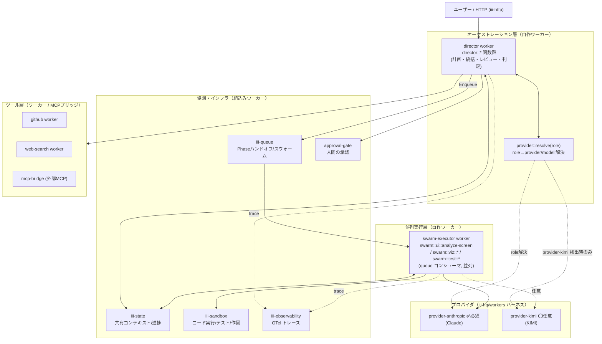

# SaaS Replicator on iii — Claude×KIMI オーケストレーション再設計書

> 元設計 `assets/original-report.md`（Claude×KIMI マルチエージェント・オーケストレーション）を、**iii のプリミティブ（Worker / Function / Trigger）上で動作する**ように再設計したもの。スコープは**設計のみ**（実コードは含まない）。実装言語は TypeScript（`iii-sdk`）を前提とする。

---

## 1. TL;DR / 結論

- **オーケストレーション基盤は iii 自身**にする。元設計の「Claw Groups + MCP + A2A」という外部・プロプライエタリ前提を、iii の **Worker / Function / Trigger + state / queue / observability** に置換する。
- **役割（role）は provider 非依存の関数**として定義し、実モデルは設定で解決する。
  - **Director（司令塔）= `provider-anthropic`（Claude）**
  - **Swarm / Analyzer / Visualizer / Tester（並列実行）= 既定は Claude、`provider-kimi` があれば自動委譲**
- **既定は Claude 単独モードで完結する。** `ANTHROPIC_API_KEY` と `provider-anthropic` だけで Phase 1〜4 を end-to-end で回せる。`provider-kimi` を `iii worker add` した瞬間に、分析・可視化・並列テストが KIMI 側へ自動的に再束縛される（progressive enhancement）。
- 「サブエージェント呼び出し = 関数呼び出し」「ツール = ワーカー」という iii の思想（`blog/.../building-agents-for-real-world.md`）に乗るため、専用のエージェント・ハーネスを発明する必要がない。元設計の階層型(Hierarchical) + スウォーム(Swarm) + パイプライン(Pipeline)はそのまま iii の shape に落ちる。

---

## 2. 背景と再設計の動機

元の `report.md` は強力な設計だが、実装基盤が以下に依存している。

| 元設計の前提 | 課題 | iii での解決 |
| --- | --- | --- |
| KIMI **Claw Groups**（共有ワークスペース） | プロプライエタリ・研究プレビュー。可観測性・移植性が外部依存 | `iii-state`（共有コンテキスト）+ ライブ・ワーカーレジストリ（`engine::workers::list`） |
| **MCP**（垂直: ツール統合） | ツールメニューが事前固定。ランタイム拡張が弱い | ツール=ワーカー。`iii worker add` でランタイムに能力追加、即発見・即呼び出し |
| **A2A**（水平: エージェント連携） | 別プロトコル・別実装が必要 | `iii.trigger()` の関数間呼び出し + ワーカー発見。iii↔iii は `iii-bridge` |
| **KIMI 必須**（300並列スウォーム） | KIMI が無いと回らない | 並列性は **queue concurrency** で担保。モデルが Claude 1 種でも並列実行は成立 |

**再設計の核心**: 「統制 = Director（Claude）」「実行 = Swarm（既定 Claude / 任意 KIMI）」という役割分離は保ちつつ、**協調・状態・並列・可観測・拡張のすべてを iii に委ねる**。これにより、(1) Claude 単独で動く、(2) KIMI を足せば強くなる、(3) すべての関数呼び出しがトレースされる、という3点を同時に満たす。

---

## 3. 全体アーキテクチャ（iii 版）

元設計の 4 層（オーケストレーション / 並列実行 / ツール・インフラ / 成果物）を、iii のワーカー・トポロジへ再配置する。



- **層の責務**: 元設計の「統制は Director、実行は Swarm」を踏襲。ただし全ハンドオフは `trigger()`、共有は `state`、並列は `queue`、可観測は `iii-observability` に統一。
- **Claude 単独時**: `kimi` ノードと「任意」エッジが消えるだけで、グラフは成立する。

---

## 4. 概念マッピング（report.md → iii）

| 元設計の概念 | iii での対応 |
| --- | --- |
| 階層型 (Hierarchical): Claude=Director | `director::*` 関数群（同期 `trigger()` で委譲・統括） |
| KIMI スウォーム（最大300並列） | named queue + 複数コンシューマ関数（`TriggerAction.Enqueue`、並列度は queue concurrency） |
| パイプライン (Phase1→4) | 関数を queue でチェーン + 進捗を `state`(scope=project) に記録 |
| Claw Groups（共有ワークスペース） | `iii-state`（共有コンテキスト）+ ライブ・ワーカーレジストリ（`engine::workers::list`） |
| MCP（垂直: ツール統合） | 各ツール=ワーカー（github / web-search / sandbox）。外部MCPサーバーは MCP ブリッジ・ワーカー |
| A2A（水平: エージェント連携） | `iii.trigger()` の関数間呼び出し + ワーカー発見。iii↔iii は `iii-bridge` |
| Claude（モデル） | `provider-anthropic::*`。**Claude単独モードでは全役割を担当** |
| KIMI（モデル） | `provider-kimi::*`。**任意**。在れば分析/可視化/テストを引受、無ければ Claude にフォールバック |
| 役割↔モデルの束縛 | **role-binding 設定**（§8）。役割は provider 非依存、実モデルは config/env で解決 |
| Document→Skill 変換 | `iii-directory`（関数が skill を `iii://<worker>/<function>` で公開・再利用） |
| 人間=協力者（collaborator） | `approval-gate`（承認ゲート）+ HTTP / Console |
| 可観測性・トレース | `iii-observability`（OTel、関数呼び出しを端から端まで追跡） |

---

## 5. ワーカー構成

### 5.1 自作ワーカー（このプロジェクトで実装する）

| ワーカー | 主な関数 | 役割 |
| --- | --- | --- |
| `director` | `director::plan`, `director::review::phaseN`, `director::prd::generate`, `director::decide` | 司令塔。Phase 分解・統括・レビュー・最終判定。Claude(`provider-anthropic`)で推論 |
| `swarm-executor` | `swarm::ui::analyze-screen`, `swarm::viz::render`, `swarm::test::run` | queue コンシューマ。並列実行（分析/可視化/テスト） |
| `provider-router`（薄い1ワーカー or director内） | `provider::resolve` | role→provider/model 解決（§8） |

### 5.2 ハーネス・ワーカー（`iii-hq/workers`、`iii worker add`）

| ワーカー | 必須/任意 | 用途 |
| --- | --- | --- |
| `provider-anthropic` | **必須** | Claude 呼び出し。Director + （単独モード時は）全役割 |
| `provider-kimi` | ⭕任意 | KIMI 呼び出し。在れば分析/可視化/テストを引受 |
| `auth-credentials` | 推奨 | プロバイダ資格情報の保管 |
| `llm-budget` | 推奨 | ワークスペース/エージェント単位のコスト上限 |
| `session` / `context-compaction` | 任意 | 会話履歴の保存・トークン圧縮 |
| `approval-gate` | 推奨 | 人間の承認ゲート（Phase 完了・リリース判定） |
| `iii-directory` | 任意 | PRD/設計書を再利用可能 skill として公開 |

### 5.3 組込みワーカー（engine 同梱）

`iii-state`（共有状態）/ `iii-queue`（ハンドオフ・スウォーム）/ `iii-pubsub`（ファンアウト）/ `iii-http`（起動エンドポイント）/ `iii-cron`（定期処理）/ `iii-observability`（トレース）/ `iii-sandbox`（libkrun microVM でのコード実行・テスト・作図）。

### 5.4 ツール・ワーカー

`github`（PR/Issue/push）/ `web-search`（技術調査）/ 外部ツールは **MCP ブリッジ・ワーカー**経由。すべて `engine::workers::list` でライブに発見でき、Director が `trigger()` で呼び出す。

---

## 6. 役割マトリックス（report §7 → iii function_id）

「主導 ◎ / 補助 ○ / なし —」。**モデル列は既定 = Claude 単独**を示す。`provider-kimi` 追加時は KIMI 列が ◎ に切り替わる役割を「⇄KIMI」で表記。

| # | タスク | iii function_id | Director(Claude) | Swarm(既定Claude) |
| --- | --- | --- | --- | --- |
| 1 | UIスクショ解析 | `swarm::ui::analyze-screen` | ○ | ◎ ⇄KIMI |
| 2 | デザイントークン抽出 | `swarm::ui::extract-tokens` | — | ◎ ⇄KIMI |
| 3 | PRD作成 | `director::prd::generate` | ◎ | ○ |
| 4 | データモデル設計 | `director::design::data-model` | ◎ | ○ |
| 5 | フロントエンド生成 | `director::impl::frontend` | ◎ | ○ |
| 6 | バックエンドAPI実装 | `director::impl::backend` | ◎ | ○ |
| 7 | 認証・認可実装 | `director::impl::auth` | ◎ | — |
| 8 | テスト・デバッグ | `swarm::test::run` (+`iii-sandbox`) | ○ | ◎ ⇄KIMI |
| 9 | パフォーマンス分析 | `swarm::test::perf` | ○ | ◎ ⇄KIMI |
| 10 | アーキテクチャ図作成 | `swarm::viz::render` (+`iii-sandbox`) | ○ | ◎ ⇄KIMI |
| 11 | 設計書・ドキュメント生成 | `director::doc::*` / `swarm::viz::*` | ◎ | ◎ |
| 12 | 進捗管理・品質レビュー | `director::review::phaseN` | ◎ | ○ |
| 13 | 技術選定・判断 | `director::decide` | ◎ | ○ |
| 14 | デプロイ・運用設定 | `director::deploy`（github/MCP） | ◎ | ○ |
| 15 | 並列タスク実行 | `iii-queue` concurrency | — | ◎ |

> Claude 単独モードでは「Swarm(既定Claude)」列の ◎ がすべて Claude で実行される。並列性は queue concurrency が担保するため、**モデルが 1 種でも「スウォーム」は成立する**。

---

## 7. 4-Phase ワークフロー（iii 実装形）

各 Phase を **関数 + トリガ + queue + state** で表現する。Phase 間ハンドオフは `TriggerAction.Enqueue`、進捗は `state`(scope=`saas/<projectId>`) に記録（`iii-architecture-patterns` の Durable Workflow / Agentic Backend に準拠）。

```mermaid
sequenceDiagram
  actor U as ユーザー
  participant H as iii-http
  participant D as director
  participant Q as iii-queue
  participant S as swarm-executor
  participant ST as iii-state
  participant SB as iii-sandbox
  participant A as approval-gate

  U->>H: POST /saas/replicate (screenshots, 要件)
  H->>D: director::plan
  D->>ST: state::set(project, {phase:1})
  Note over D,Q: Phase 1 UI分析（Swarm主導）
  D->>Q: Enqueue swarm::ui::analyze-screen × N画面（並列）
  Q->>S: 各画面を並列処理
  S->>ST: state::update(phase1, 結果を集約)
  S-->>D: 全画面完了（state監視/集約関数）
  D->>D: director::review::phase1
  Note over D: Phase 2 PRD（Director主導）
  D->>D: director::prd::generate (provider-anthropic)
  D->>Q: Enqueue swarm::viz::render（図表; 既定Claude+sandbox）
  Note over D,SB: Phase 3 実装（Director主導 + Swarmテスト）
  D->>D: director::impl::* (FE/BE/auth)
  D->>Q: Enqueue swarm::test::run
  Q->>S: 並列テスト
  S->>SB: sandbox::run（隔離実行）
  S->>ST: テスト結果
  D->>D: director::review::phase3（Supervisor）
  Note over D,A: Phase 4 可視化・デプロイ（Swarm主導 + Director判定）
  D->>Q: Enqueue swarm::viz::*（図/レポート）
  D->>A: approval-gate（リリース判定）
  A-->>U: 承認要求
  U-->>A: 承認
  D->>D: director::deploy（github / MCP）
  D-->>U: 公開URL / 成果物
```

- **Phase 1（UI分析・Swarm主導）**: `saas::phase1::start` が画面ごとに `swarm::ui::analyze-screen` を `Enqueue`（並列）。結果は `state(scope=saas/<id>, key=phase1)` に集約 → `director::review::phase1`。
- **Phase 2（PRD・Director主導）**: `director::prd::generate`（Claude）。図表は `swarm::viz::render`（既定 Claude + `iii-sandbox` で描画、`provider-kimi` 在れば委譲）。
- **Phase 3（実装・Director主導 + Swarmテスト）**: `director::impl::*` がコード生成 → `swarm::test::run` が `iii-sandbox` で並列テスト → `director::review::phase3`（Supervisor パターン）。
- **Phase 4（可視化・デプロイ・Swarm主導 + Director判定）**: 図/レポート生成 → `approval-gate` で人間承認 → `director::deploy`。

---

## 8. プロバイダ抽象と Claude 単独モード（必須要件）

### 8.1 role-binding（役割→モデル解決）

役割関数はモデルを直接呼ばず、必ず `provider::resolve(role)` を経由する。

```ts
// provider::resolve の責務（擬似コード／実装は後続）
// 1) state(scope="config", key="role-bindings") を読む
// 2) 無ければ既定（全役割 → provider-anthropic）
// 3) provider-kimi が登録済みなら analyzer/visualizer/tester/swarm を kimi に再束縛
// 戻り値: { function_id: "provider-anthropic::messages", model: "claude-..." }
```

### 8.2 既定 = Claude 単独

| 役割 | Claude 単独モード（既定） | Claude×KIMI モード |
| --- | --- | --- |
| director | `provider-anthropic` | `provider-anthropic` |
| analyzer (UI解析) | `provider-anthropic`（vision） | `provider-kimi` |
| visualizer (作図) | `provider-anthropic` + `iii-sandbox` | `provider-kimi` |
| tester | `provider-anthropic` + `iii-sandbox` | `provider-kimi` |
| swarm（並列実行） | `provider-anthropic` ×N（queue並列） | `provider-kimi` ×N |

- `ANTHROPIC_API_KEY` と `provider-anthropic` だけで Phase 1〜4 が end-to-end で成立する。
- **段階的強化**: 起動時に `engine::workers::list` で `provider-kimi` を検出したら、`analyzer/visualizer/tester/swarm` を自動的に `provider-kimi` へ再束縛（config で明示上書きも可能）。

### 8.3 KIMI 固有機能の Claude 単独での代替

| KIMI 固有とされた能力 | Claude 単独での代替 |
| --- | --- |
| 画像分析（UIスクショ） | Claude のマルチモーダル（vision）入力 |
| データ可視化（IPython） | `iii-sandbox` で Python/Node を隔離実行し図/グラフ生成 |
| 並列スウォーム（300） | `iii-queue` concurrency による並列（モデル1種でも成立） |
| Document→Skill | `iii-directory` に PRD/設計書を skill 登録 |

---

## 9. オーケストレーションパターンの iii 実装

| パターン | iii の shape | Claude 単独時の挙動 |
| --- | --- | --- |
| 階層型 (Hierarchical) | `director::*` が `trigger()` で各役割へ委譲 | 同一（モデルが1種） |
| スウォーム (Swarm) | `TriggerAction.Enqueue({queue})` + 複数コンシューマ | 並列は維持（Claude ×N） |
| パイプライン (Pipeline) | Phase 関数を queue でチェーン + `state` 進捗 | 同一 |
| スーパーバイザー (Supervisor) | `director::review::*` が Swarm 出力を監視・判定 | 同一 |
| デベート (Debate) | 2 モデルへ並行 `trigger()` → director が集約 | **self-critique に縮退**（同一モデルの別役割関数で相互批判） |

---

## 10. 実装時の推奨構成（参考・このフェーズではコードを書かない）

```
examples/saas-replicator/
  DESIGN.md            ← 本書
  README.md            ← 概要・起動手順
  assets/              ← 元コンセプト図（参照用）
  （後続実装で追加）
  iii-config.yaml      ← engine 設定（ワーカー一覧 / ポート / queue concurrency）
  package.json         ← iii-sdk 依存
  src/
    director.ts        ← director::* 関数 + HTTP トリガ
    swarm.ts           ← swarm::* 関数 + queue(durable:subscriber) トリガ
    provider.ts        ← provider::resolve（role-binding）
    phases/
      phase1.ts        ← UI分析（fan-out → 集約）
      phase2.ts        ← PRD/設計
      phase3.ts        ← 実装 + sandbox テスト
      phase4.ts        ← 可視化 + approval + deploy
```

例示スニペット（AGENTS.md 規約準拠: `::` 区切り、`api_path` 先頭 `/`、cron は `expression`）:

```ts
import { registerWorker, TriggerAction } from "iii-sdk";

const iii = registerWorker(process.env.III_URL ?? "ws://localhost:49134", {
  workerName: "director",
});

// 起動エンドポイント（HTTP トリガ）
iii.registerFunction("director::plan", async (input) => {
  const projectId = crypto.randomUUID();
  await iii.trigger({
    function_id: "state::set",
    payload: { scope: `saas/${projectId}`, key: "status", value: { phase: 1 } },
  });
  // Phase 1: 画面ごとに並列投入（スウォーム）
  for (const screen of input.screenshots) {
    await iii.trigger({
      function_id: "swarm::ui::analyze-screen",
      payload: { projectId, screen },
      action: TriggerAction.Enqueue({ queue: "phase1-ui" }),
    });
  }
  return { projectId };
});

iii.registerTrigger({
  type: "http",
  function_id: "director::plan",
  config: { api_path: "/saas/replicate", http_method: "POST" },
});

// 役割→モデル解決を経由してモデルを呼ぶ
async function callRole(role: string, messages: unknown) {
  const { function_id, model } = await iii.trigger({
    function_id: "provider::resolve",
    payload: { role },
  });
  return iii.trigger({ function_id, payload: { model, messages } });
}
```

```ts
// swarm.ts — queue コンシューマ（並列はエンジンの concurrency が担保）
iii.registerFunction("swarm::ui::analyze-screen", async ({ projectId, screen }) => {
  const result = await callRole("analyzer", [{ role: "user", image: screen }]);
  await iii.trigger({
    function_id: "state::update",
    payload: {
      scope: `saas/${projectId}`,
      key: "phase1",
      ops: [{ op: "set", path: `/screens/${screen.id}`, value: result }],
    },
  });
});

iii.registerTrigger({
  type: "durable:subscriber",
  function_id: "swarm::ui::analyze-screen",
  config: { topic: "phase1-ui" },
});
```

---

## 11. 実行・検証手順（設計）

### 11.1 Claude 単独モード（既定）

```bash
export ANTHROPIC_API_KEY=sk-...
iii --config iii-config.yaml                 # engine 起動（ws:49134 / REST:3111 / console:3113）
iii worker add iii-state iii-queue iii-sandbox iii-observability approval-gate
iii worker add provider-anthropic            # Claude のみ
# 自作ワーカー（director / swarm-executor）を起動（pnpm dev など）
curl -X POST http://localhost:3111/saas/replicate \
  -H 'Content-Type: application/json' \
  -d '{"target":"Trello","screenshots":[...],"requirements":"日本語UI/PWA/レスポンシブ"}'
# Console(:3113) で関数呼び出しのトレース・state・queue を確認
```

### 11.2 Claude×KIMI モード（段階的強化）

```bash
iii worker add provider-kimi                  # これを足すだけ
# 起動時検出により analyzer/visualizer/tester/swarm が自動的に KIMI へ再束縛される
```

### 11.3 設計書としての検証

- Markdown / Mermaid がレンダリング破綻なく表示されること。
- 記載の function_id / トリガ設定が AGENTS.md 規約（`::`、`api_path` 先頭 `/`、cron `expression`）に準拠していること。
- `.skill-check.yaml` は `docs/**` のみ対象。本書は `examples/` 配下のため CI 非干渉。

---

## 12. リスクと対策（iii マッピング）

| リスク | 対策（iii） |
| --- | --- |
| レート制限 / コスト爆発 | `iii-queue` concurrency 制限 + `llm-budget` の上限 + コストアラート |
| コーディネータ故障 | durable queue（再配送）+ `state` チェックポイント（Phase 進捗の永続化） |
| エージェント間通信エラー | `state` に中間成果物を保存（疎結合）/ iii↔iii は `iii-bridge` |
| 品質のばらつき | `director::review::*` の統合レビュー + `approval-gate` の人間承認 |
| **単一プロバイダ依存（Claude単独時の SPOF / コスト集中）** | queue concurrency 制御 + `llm-budget` 上限 + 将来 provider 追加で水平分散 |
| AI生成コードの脆弱性 | `director::impl::auth` をレビュー必須化 + `iii-sandbox` での隔離実行 |

---

## 13. 段階的実装ロードマップ

1. **Claude 単独の動く骨格** — 既定 role-binding = `provider-anthropic`。Phase 1〜4 を end-to-end でつなぐ（各 Phase は最小実装/スタブ可）。
2. **`provider-kimi` 追加による段階的強化** — 起動時自動再束縛で分析/可視化/テストを KIMI に委譲。
3. **各 Phase の実体化** — UI解析の精度、PRD テンプレート、実装スキャフォルド、デプロイ連携を順次強化。

---

## 付録: 参照した既存資産

- パターン: `skills/iii-architecture-patterns/SKILL.md`（Agentic Backend / Durable Workflow / Reactive）
- SDK API: `sdk/packages/node/iii/src/iii.ts`（`trigger` / `TriggerAction` / `registerFunction` / `registerTrigger`）
- ワーカー: `crates/iii-worker/src/sandbox_daemon/README.md`（sandbox）、`engine/src/workers/{state,bridge_client,shell,engine_fn}/README.md`
- ハーネス思想: `blog/src/content/blog/{how-to-build-your-own-agent-harness,building-agents-for-real-world}.md`
- 規約: `AGENTS.md`
- 元設計: `assets/original-report.md` および `assets/*.png`
