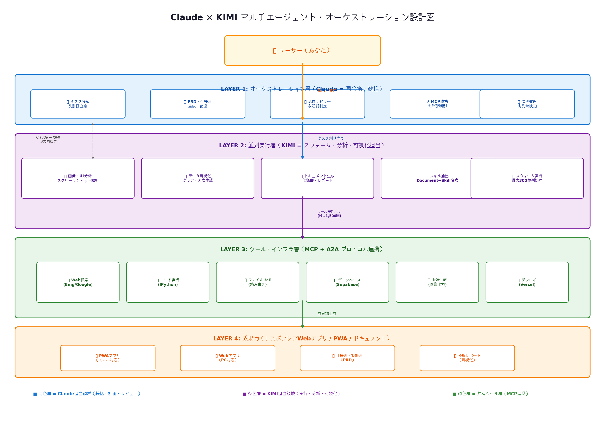
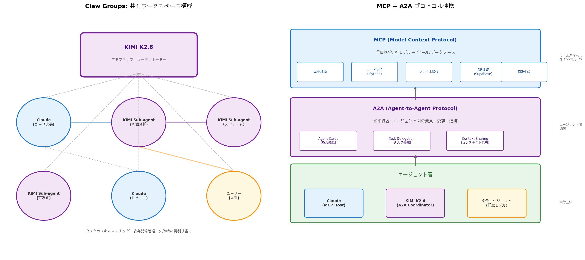
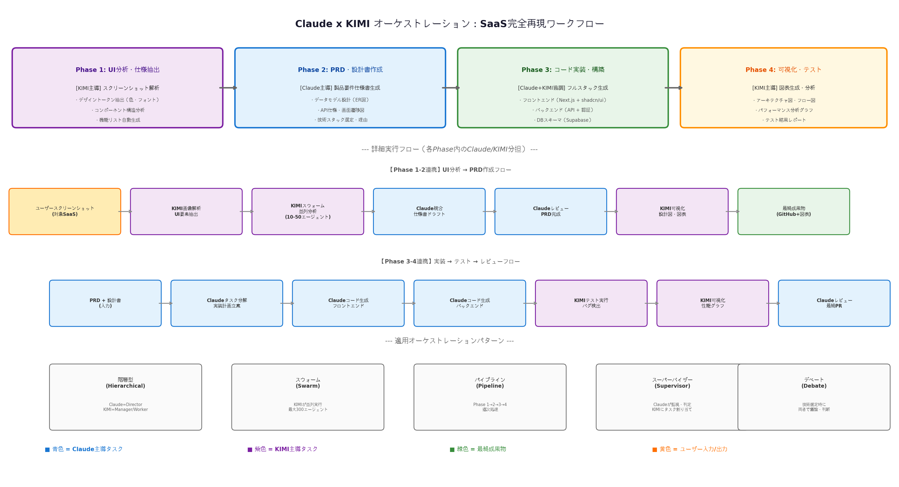
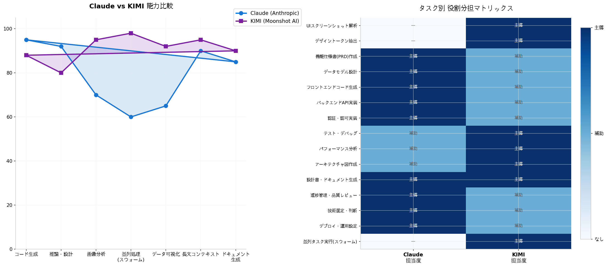

# Claude × KIMI マルチエージェント・オーケストレーション設計書：業務SaaS完全再現システム

## TL;DR（結論）

**Claude（Anthropic）とKIMI（Moonshot AI）を主軸としたマルチエージェント・オーケストレーションの最適構成は、「Claude = 司令塔・統括（Director）」「KIMI = 並列実行・分析・可視化（Swarm Executor）」という階層型（Hierarchical）アーキテクチャです。** この設計では、ClaudeがMCP（Model Context Protocol）を通じてツール連携と統括管理を担当し、KIMI K2.6が最大300サブエージェントのスウォーム実行と画像・データ分析を担当します。両者はKIMIの**Claw Groups**機能で共有ワークスペースに配置され、A2A（Agent-to-Agent Protocol）で水平連携します。SaaSの完全再現においては、**Phase 1（UI分析）はKIMIが主導、Phase 2（PRD作成）はClaudeが主導、Phase 3（実装）はClaudeがコード生成・KIMIがテスト、Phase 4（可視化）はKIMIが主導**という役割分担が最も効率的です。この構成により、従来の1/10以下の時間で、業務SaaSに近い品質の「自分用ツール」を構築できます。

---

## 1. なぜClaudeとKIMIなのか：両者の相乗効果

### 1.1 Claudeの強み：統括・設計・コードの司令塔

Claudeは2026年時点で最も成熟したAIコーディングエージェントの一つであり、**MCP（Model Context Protocol）**という業界標準プロトコルをネイティブサポートしています [(IBM)](https://www.ibm.com/think/topics/model-context-protocol) 。MCPは「USB-Cポート」として機能し、AIアプリケーションと外部ツール・データソース間の標準化された接続を提供します。Claude Codeは**200万トークン**に及ぶ長大なコンテキストウィンドウを持ち、複雑なコードベース全体を一度に理解できます。さらに、Claudeは**7つのオーケストレーションパターン**（Single Agent、Supervisor、Swarm、Pipeline、Debate、Hierarchical、Harness）をネイティブサポートしており、マルチエージェント開発の司令塔として最適です [(developersdigest.tech)](https://www.developersdigest.tech/blog/seven-ai-agent-orchestration-patterns) 。

| Claudeの強み | 具体的な能力 | オーケストレーションでの役割 |
|-------------|-------------|---------------------------|
| **MCPネイティブ対応** | 200+のMCPサーバー実装（GitHub、Slack、PostgreSQL等）と連携 [(Medium)](https://medium.com/devops-ai-decoded/top-10-mcp-servers-for-ai-agent-orchestration-in-2026-78cdb38e9fba)  | ツール連携のハブとして機能 |
| **コード理解・生成** | 業界最高レベルのコード補完・リファクタリング能力 | フロントエンド・バックエンド実装の主担当 |
| **推論・設計能力** | 複雑なアーキテクチャ判断・技術選定に強い | PRD作成・技術選定の最終判断 |
| **タスク管理** | Taskツールによるサブエージェント生成・監視 | タスク分解・進捗管理・品質レビュー |
| **CLAUDE.md** | プロジェクト固有のルール・規約を永続化 | 一貫性のあるコード生成を保証 |

### 1.2 KIMIの強み：並列実行・分析・可視化のスペシャリスト

KIMI K2.6はMoonshot AIが開発した**オープンソースモデル**で、業界初のネイティブエージェントスウォーム機能を持ちます [(kimi.com)](https://www.kimi.com/ai-models/kimi-k2-6) 。最大**300サブエージェント**を**4,000ステップ**にわたり協調実行でき、単一エージェントと比較して**4.5倍の高速化**を実現します。さらに**Claw Groups**機能により、異なるデバイス・異なるモデル・異なるツールセットを持つエージェントを共有ワークスペースで協調させることができます [(kimi.com)](https://www.kimi.com/blog/kimi-k2-6) 。KIMIは**画像分析**、**データ可視化**、**Document→Skill変換**にも強く、SaaS再現における「分析」と「可視化」の面でClaudeを補完します。

| KIMIの強み | 具体的な能力 | オーケストレーションでの役割 |
|-------------|-------------|---------------------------|
| **エージェントスウォーム** | 最大300並列エージェント、4,000ステップ協調 [(substack.com)](https://handyai.substack.com/p/model-drop-kimi-k26)  | 大規模並列処理・分析の主担当 |
| **Claw Groups** | 異機種エージェントの共有ワークスペース協調 [(kimi.com)](https://www.kimi.com/blog/kimi-k2-6)  | Claudeとの橋渡し・連携ハブ |
| **マルチモーダル分析** | テキスト・画像・動画の統合理解 | UIスクリーンショット解析・デザイン抽出 |
| **データ可視化** | IPython環境でのグラフ・図表自動生成 | アーキテクチャ図・フロー図・性能グラフ作成 |
| **Document→Skill変換** | 高品質ドキュメントから再利用可能スキルを抽出 [(kimi.com)](https://www.kimi.com/ai-models/kimi-k2-6)  | PRD・設計書から実装テンプレートを生成 |

### 1.3 両者の相乗効果：1+1 = 3の理由

ClaudeとKIMIを組み合わせる最大の理由は、**両者の強みが完全に補完関係**にあることです。Claudeはコード生成・推論・設計で卓越していますが、並列処理・画像分析・データ可視化ではKIMIに劣ります。逆にKIMIはスウォーム実行・画像分析・可視化で卓越していますが、複雑なアーキテクチャ設計・コードレビューではClaudeに劣ります。この相補性を活かすことで、**「Claudeが設計と実装の質を担保し、KIMIが処理速度と分析の幅を拡張する」**というシナジーが生まれます。

特に重要なのは、KIMIの**Claw Groups**が「異機種エージェント」の協調をサポートしている点です。Claw Groupsでは、Claude（MCP Hostとして）もKIMIの共有ワークスペースに参加でき、KIMI K2.6が**アダプティブ・コーディネーター**として両者間のタスク配分・依存関係管理・失敗時の再割り当てを自動化します [(kimi.com)](https://www.kimi.com/blog/kimi-k2-6) 。これにより、人間が個別にエージェントを管理する必要がなくなり、「AIチーム」として自律的に動作します。

---

## 2. 全体アーキテクチャ：4層階層型設計

### 2.1 アーキテクチャ概要図

本システムは**4層の階層型アーキテクチャ**を採用します。最上位層でClaudeが統括し、下位層でKIMIが並列実行を担当する構成です。この設計は、2026年のAIエージェント開発において最も実績のある**Hierarchical + Swarm + Pipeline**の複合パターンに基づいています [(developersdigest.tech)](https://www.developersdigest.tech/blog/seven-ai-agent-orchestration-patterns) 。



### 2.2 各層の責任範囲

| 層 | 名前 | 主担当AI | 役割 | プロトコル |
|---|------|---------|------|-----------|
| **Layer 1** | オーケストレーション層 | **Claude** | タスク分解・計画立案・PRD管理・品質レビュー・進捗監視 | MCP (Host) |
| **Layer 2** | 並列実行層 | **KIMI K2.6** | 画像分析・スウォーム実行・データ可視化・ドキュメント生成 | A2A (Coordinator) |
| **Layer 3** | ツール・インフラ層 | **Claude + KIMI共有** | Web検索・コード実行・ファイル操作・DB連携・デプロイ | MCP + A2A |
| **Layer 4** | 成果物層 | **両者協調** | PWAアプリ・Webアプリ・仕様書・分析レポート | 出力フォーマット |

この4層構造の核心は、**「統制はClaudeが、実行はKIMIが」**という責任分離にあります。Claudeは「何を」「どの順番で」「どの品質基準で」という戦略的判断を担当し、KIMIは「どれだけ速く」「どれだけ並列で」「どれだけ正確に」という戦術的実行を担当します。

### 2.3 層間のデータフロー

ユーザーからの指示はまず**Layer 1（Claude）**に入ります。Claudeは指示を分析し、タスクをPhaseに分解します。UI分析が必要なPhase 1では、**ClaudeがKIMIにタスクを委譲**し、KIMIがLayer 2でスウォームを起動して画像解析を並列実行します。解析結果はKIMIからClaudeに返り、Claudeがそれを統合してPRDを作成します。実装Phase 3では、Claudeがコードを生成し、KIMIが自動テストを並列実行してバグを検出します。最終的な成果物はLayer 4で統合され、ユーザーに提示されます。

---

## 3. Layer 1: オーケストレーション層（Claude = 司令塔・統括）

### 3.1 司令塔としてのClaudeの役割

Layer 1は、**Claudeが唯一の司令塔**として機能します。この層では、Claudeが**Hierarchicalパターン**のDirectorに相当し、全体的な戦略立案・タスク分解・品質管理・進捗監視を行います。具体的には以下の5つの役割を担当します。

| 役割 | 詳細 | 使用ツール・機能 |
|------|------|----------------|
| **タスク分解・計画立案** | ユーザーの要件を受けて、Phase単位に分解し、各Phaseの入出力と依存関係を定義 | Claude Code Taskツール、CLAUDE.md |
| **PRD・仕様書生成・管理** | 機能仕様書（PRD）を作成し、設計図として全エージェントの参照基準を管理 | 長文コンテキスト、MCPファイル操作 |
| **品質レビュー・最終判定** | 生成されたコード・ドキュメントの品質をレビューし、リリース可否を判定 | 推論能力、Debateパターン |
| **MCP連携・外部制御** | MCPサーバーを通じて外部ツール（GitHub、DB、検索）を統合制御 | MCP Host機能、200+サーバー連携 |
| **進捗管理・異常検知** | 各エージェントの進捗を監視し、遅延やエラーを検知して対処 | Taskツールのステータス監視 |

### 3.2 MCP Hostとしての機能

Claudeは**MCP Host**として動作し、複数のMCPクライアントを統合管理します [(IBM)](https://www.ibm.com/think/topics/model-context-protocol) 。MCPは「USB-C for AI」として機能し、一度接続したツールはどのMCP対応アプリケーションでも再利用できます。Claude Codeでは、`claude_desktop_config.json`にMCPサーバーを登録するだけで、Web検索、ファイル操作、データベース連携、GitHub操作などが可能になります。

```json
// MCPサーバー設定例（claude_desktop_config.json）
{
  "mcpServers": {
    "github": {
      "command": "npx",
      "args": ["-y", "@modelcontextprotocol/server-github"],
      "env": { "GITHUB_PERSONAL_ACCESS_TOKEN": "<token>" }
    },
    "supabase": {
      "command": "npx",
      "args": ["-y", "@modelcontextprotocol/server-supabase"]
    },
    "web-search": {
      "command": "uvx",
      "args": ["mcp-server-web-search"]
    }
  }
}
```

このMCP連携により、ClaudeはKIMIから受け取った分析結果をそのままGitHubにプッシュしたり、Supabaseにデータベーススキーマを適用したり、Web検索で最新情報を補完したりできます。MCPは**ステートレス**なプロトコルであるため、ClaudeとKIMI間の連携においても中間状態の保持が容易です [(Morph AI)](https://www.morphllm.com/ai-agent-framework) 。

### 3.3 CLAUDE.md: プロジェクトの「憲法」

Claudeの重要な機能の一つが、**CLAUDE.md**によるプロジェクトルールの永続化です。プロジェクトルートにCLAUDE.mdを配置すると、Claudeは全セッションでこのファイルを参照し、一貫した挙動を保証します。SaaS再現プロジェクトでは、以下のような内容をCLAUDE.mdに記述します。

```markdown
# SaaS Replication Project - Claude Configuration

## Role
You are the Director agent in a multi-agent orchestration system.
Your partner is KIMI K2.6, which handles parallel execution, 
image analysis, and data visualization.

## Tech Stack
- Next.js 15 (App Router)
- TypeScript (strict mode)
- Tailwind CSS + shadcn/ui
- Supabase (PostgreSQL + Auth + RLS)
- Vercel (deployment + PWA)

## Orchestration Rules
1. ALWAYS decompose user requests into Phases before execution
2. Delegate image analysis and visualization tasks to KIMI
3. Retain final authority on architecture decisions and code review
4. Use MCP tools for GitHub, DB, and deployment operations
5. All UI text must be in Japanese
6. Mobile-first responsive design (375px / 768px / 1440px breakpoints)

## Communication Protocol with KIMI
- Send structured task descriptions with expected output format
- Receive analysis results in markdown with image attachments
- Synthesize KIMI's outputs into PRD or implementation plans
```

このCLAUDE.mdにより、Claudeは「KIMIと協調する司令塔」としての自覚を持ち、一貫した統制を行えます。

---

## 4. Layer 2: 並列実行層（KIMI = スウォーム・分析・可視化担当）

### 4.1 KIMI K2.6のスウォーム実行能力

Layer 2の核心は、KIMI K2.6の**Agent Swarm**機能です。K2.6は最大**300サブエージェント**を並列生成し、**4,000ステップ**にわたり協調実行できます [(substack.com)](https://handyai.substack.com/p/model-drop-kimi-k26) 。このスウォームは「均一な並列処理」ではなく、**異種分解（heterogeneous decomposition）**を採用しています。つまり、コーディネーター（K2.6自身）がタスク構造を分析し、コードリファクタリングにはコードエージェント、研究合成にはリサーチエージェント、ドキュメント生成にはライティングエージェントと、**スキルプロファイルに基づいて動的にエージェントを割り当て**ます [(AI Coding Tool for Developers)](https://www.verdent.ai/guides/kimi-k2-6-agent-swarm) 。

| スウォーム機能 | 仕様 | SaaS再現での活用 |
|-------------|------|----------------|
| **最大並列エージェント数** | 300エージェント [(substack.com)](https://handyai.substack.com/p/model-drop-kimi-k26)  | UI要素の並列解析（50-100要素同時） |
| **最大協調ステップ数** | 4,000ステップ | 複雑な多段階分析ワークフロー |
| **ツール呼び出し上限** | 1,500回/実行 | Web検索+スクレイピング+ファイル操作 |
| **分解方式** | 異種分解（スキルマッチング） [(AI Coding Tool for Developers)](https://www.verdent.ai/guides/kimi-k2-6-agent-swarm)  | UI分析・コード生成・テストを専門エージェントに分担 |
| **速度向上率** | 単一エージェント比4.5倍 [(till-freitag.com)](https://till-freitag.com/en/blog/agent-swarm-architectures-compared)  | 分析時間を1/4以下に短縮 |

### 4.2 Claw Groups: ClaudeとKIMIの共有ワークスペース

**Claw Groups**はKIMI K2.6の研究プレビュー機能で、**異機種エージェント**（異なるデバイス、異なるモデル、異なるツールセットを持つエージェント）を共有ワークスペースで協調させることができます [(kimi.com)](https://www.kimi.com/blog/kimi-k2-6) 。Claw Groupsの中心的な役割を担うのは**アダプティブ・コーディネーター**です。コーディネーターは以下を自動化します。

- **スキルマッチング**: 各エージェントのスキルプロファイルと利用可能ツールに基づいて、タスクを最適なエージェントに動的に割り当て
- **依存関係管理**: タスク間の依存関係を追跡し、正しい順序で実行をスケジュール
- **失敗検知・再割り当て**: エージェントが失敗や停滞を検知すると、自動的にタスクを再割り当てまたはサブタスクを再生成
- **デリバラブルのライフサイクル管理**: 開始→検証→完了までの全ライフサイクルを能動的に管理

Claw GroupsにClaude（MCP Host）とKIMIサブエージェント（画像分析・スウォーム・可視化）を配置し、ユーザー（人間）も同じワークスペースに参加することで、**「人間-AI」の本当のパートナーシップ**が実現します [(kimi.com)](https://www.kimi.com/blog/kimi-k2-6) 。



### 4.3 KIMIの画像分析と可視化能力

SaaS再現において、KIMIの**マルチモーダル分析**能力は特に重要です。ユーザーがアップロードしたスクリーンショットから、KIMIは以下を自動抽出します。

- **デザイントークン**: カラーパレット（HEX/RGB値）、フォントファミリー・サイズ・ウェイト、スペーシング値
- **UIコンポーネント構造**: ボタン、カード、フォーム、モーダル、ナビゲーションの構成と階層
- **レイアウト情報**: グリッドシステム、ブレークポイント、フレックス/グリッド配置
- **インタラクション推測**: ホバー状態、クリック動作、遷移アニメーションの推定

さらにKIMIの**IPython環境**と連携した**データ可視化**により、アーキテクチャ図、フローチャート、性能グラフ、進捗レポートを自動生成できます。これらの可視化成果物は、Claudeが作成したPRDとともに、プロジェクトの「設計図」として機能します。

---

## 5. Layer 3: ツール・プロトコル層（MCP + A2A 連携）

### 5.1 MCP（Model Context Protocol）: 垂直統合

MCPは**垂直統合**を担当し、AIモデルからツール・データソースへの標準化されたアクセスを提供します [(Morph AI)](https://www.morphllm.com/ai-agent-framework) 。MCPはJSON-RPCベースのクライアント・サーバーインターフェースで、typed data exchangeを実現します。2026年時点で**200以上のMCPサーバー実装**が存在し、GitHub、Slack、Google Drive、PostgreSQL、Notion、Jira、Salesforceなどが含まれます [(Morph AI)](https://www.morphllm.com/ai-agent-framework) 。

| MCPサーバー | 機能 | SaaS再現での活用 |
|-----------|------|----------------|
| **GitHub MCP** | リポジトリ操作、PR作成、Issue管理 | コードの自動プッシュ・レビュー |
| **Supabase MCP** | DBスキーマ操作、RLSポリシー管理 | データベース構築・認証設定 |
| **Web Search MCP** | Bing/Google検索、スクレイピング | 技術情報収集・UIトレンド調査 |
| **File System MCP** | ローカルファイル読み書き | コード生成・設定ファイル編集 |
| **Puppeteer/Playwright MCP** | ブラウザ自動操作、スクリーンショット | UIテスト・E2Eテスト |

Claudeは**MCP Host**としてこれらのサーバーを統合管理し、KIMIからのタスク実行要求に応じて適切なツールを呼び出します。MCPは「ツールを呼び出す方法」を標準化しますが、「いつ・どのツールを・何のために呼び出すか」は、Claudeの推論により決定されます [(IBM)](https://www.ibm.com/think/topics/model-context-protocol) 。

### 5.2 A2A（Agent-to-Agent Protocol）: 水平統合

A2Aは**水平統合**を担当し、エージェント間の発見・委譲・連携を標準化します [(Morph AI)](https://www.morphllm.com/ai-agent-framework) 。2026年時点で、IBMのACP（Agent Communication Protocol）がGoogleのA2Aに統合され、Linux Foundation下で標準化が進んでいます [(Morph AI)](https://www.morphllm.com/ai-agent-framework) 。A2Aの主な構成要素は以下の通りです。

| A2A要素 | 機能 | 本設計での活用 |
|--------|------|-------------|
| **Agent Cards** | エージェントの能力・スキル・利用可能ツールを記述 | ClaudeとKIMIの能力プロファイルの交換 |
| **Task Delegation** | エージェント間のタスク委譲・受け入れ | Claude→KIMIへのタスク委譲、KIMI→Claudeへの結果返却 |
| **Context Sharing** | エージェント間のコンテキスト・状態共有 | PRD、分析結果、コードの双方向共有 |
| **Skill Profiles** | エージェントの専門スキルの定義・照合 | KIMIのコーディネーターが最適エージェントを選択 |

A2Aを通じて、ClaudeとKIMIは「お互いの能力を理解しながら」タスクを分担します。例えば、Claudeが「このUI要素の色コードを抽出して」とKIMIに依頼する際、A2AのAgent Cardsを通じてKIMIが「画像分析スキルを持つ」ことをClaudeが確認し、適切なタスク委譲が行われます。

### 5.3 プロトコルの使い分け

| 観点 | MCP | A2A |
|------|-----|-----|
| **統合方向** | 垂直: AIモデル ↔ ツール/データ | 水平: エージェント ↔ エージェント |
| **解決する問い** | "ツールをどう呼び出すか？" | "エージェント間でどう連携するか？" |
| **プロトコル形式** | JSON-RPC | REST-native (A2A) |
| **状態管理** | ステートレス（サーバー固有の状態あり） | セッション・タスク状態を共有 |
| **本設計での役割** | Claudeがツールを統合管理 | KIMIがエージェント間を調整 |

---

## 6. ワークフロー設計：SaaS完全再現の4Phase

### 6.1 全体ワークフロー概略

SaaSの完全再現をClaude×KIMIオーケストレーションで行う場合、**4つのPhase**に分解して実行します。各Phaseでは、ClaudeとKIMIが主導・補助の役割を入れ替えながら協調します。



### 6.2 Phase 1: UI分析・仕様抽出（KIMI主導、Claude監視）

Phase 1では、ユーザーがアップロードした対象SaaSのスクリーンショットを分析し、UI要素と機能リストを抽出します。このPhaseは**KIMIが主導**し、Claudeは統括・監視の役割です。

| ステップ | 担当 | 処理内容 | 出力 |
|---------|------|---------|------|
| 1. スクリーンショットアップロード | ユーザー | PC版・スマホ版の全画面をキャプチャ | 画像ファイル群 |
| 2. 画像解析 | **KIMI** | UI要素の検出・分類（ボタン、カード、フォーム等） | 要素リスト（JSON） |
| 3. デザイントークン抽出 | **KIMI** | 色・フォント・スペーシングの自動抽出 | デザイントークン（CSS変数形式） |
| 4. 並列構造分析 | **KIMIスウォーム** | 10-50エージェントで画面ごとに並列分析 | 統合された構造分析書 |
| 5. 機能リスト生成 | **KIMI** | UI要素から推測される機能の自動リスト化 | 機能要件リスト（優先度付き） |
| 6. 統合・レビュー | **Claude** | KIMIの分析結果を統合し、PRDドラフト作成 | PRDドラフト（markdown） |

KIMIのスウォームは、各画面に1エージェントを割り当てて並列に解析することで、**従来の逐次分析と比較して4.5倍の速度**で処理を完了します。例えば、20画面のSaaスクリーンショット分析を、1エージェントあたり4分で並列処理すれば、全体で4分（+統合時間）で完了します。

### 6.3 Phase 2: PRD・設計書作成（Claude主導、KIMI補助）

Phase 2では、Phase 1の分析結果を基に、**製品要件仕様書（PRD）**と各種設計書を作成します。このPhaseは**Claudeが主導**し、KIMIは可視化・ドキュメント生成で補助します。

| ステップ | 担当 | 処理内容 | 出力 |
|---------|------|---------|------|
| 1. PRD作成 | **Claude** | 機能要件・非機能要件・ユーザーストーリーの詳細化 | PRD（完全版） |
| 2. データモデル設計 | **Claude** | ER図・テーブル定義・リレーション設計 | DBスキーマ定義（SQL） |
| 3. API仕様設計 | **Claude** | エンドポイント・リクエスト/レスポンス・認証設計 | OpenAPI仕様書 |
| 4. UI/UX設計 | **Claude** | 画面遷移図・コンポーネント仕様・状態管理設計 | UI仕様書 |
| 5. 技術スタック選定 | **Claude** | フレームワーク・ライブラリ・インフラの選定と理由 | 技術選定書 |
| 6. 設計図可視化 | **KIMI** | ER図・アーキテクチャ図・フローチャートの自動生成 | 図表群（PNG/SVG） |

Claudeの**推論能力**がこのPhaseで最大限に活かされます。特に「なぜこの技術スタックなのか」「このデータモデルの妥当性はどうか」といった判断は、Claudeの分析に委ねるのが最適です。KIMIはClaudeが設計した内容を**視覚的な図表**に変換し、人間の確認を容易にします。

### 6.4 Phase 3: コード実装・構築（Claude主導、KIMIテスト・可視化）

Phase 3では、PRDに基づいて実際のコードを生成します。このPhaseは**Claudeがフロントエンド・バックエンドのコード生成を主導**し、KIMIがテスト・パフォーマンス分析・可視化を担当します。

| ステップ | 担当 | 処理内容 | 出力 |
|---------|------|---------|------|
| 1. タスク分解・実装計画 | **Claude** | 垂直スライス方式で実装タスクに分解 | 実装計画書（タスク一覧） |
| 2. フロントエンド実装 | **Claude** | Next.js + shadcn/ui + Tailwind CSSでUI構築 | Reactコンポーネント群 |
| 3. バックエンド実装 | **Claude** | APIルート・認証・DB連携を実装 | APIエンドポイント群 |
| 4. DBスキーマ適用 | **Claude** (MCP) | Supabaseにスキーマを適用・RLS設定 | 適用済みDB |
| 5. 自動テスト実行 | **KIMI** | 並列テスト・バグ検出・カバレッジ測定 | テスト結果レポート |
| 6. パフォーマンス分析 | **KIMI** | ロード時間・メモリ使用量・API応答時間測定 | 性能グラフ・レポート |
| 7. バグ修正指示 | **Claude** | KIMIのテスト結果を基にコード修正 | 修正済みコード |
| 8. 最終レビュー | **Claude** | 全コードの品質レビュー・PR作成 | GitHub PR |

このPhaseでは、Claudeの**MCP連携**が最大限に活かされます。ClaudeはMCPを通じて、コードを生成したら即座にGitHubにプッシュし、Supabaseにスキーマを適用し、Vercelにデプロイできます。KIMIは並列テストエージェントを起動し、複数のブラウザ・デバイスサイズで同時にテストを実行します。

### 6.5 Phase 4: 可視化・テスト・デプロイ（KIMI主導、Claude最終判定）

Phase 4では、テスト結果の可視化・ドキュメント整備・デプロイを行います。このPhaseは**KIMIが可視化とテストを主導**し、Claudeが最終レビューとデプロイ判定を担当します。

| ステップ | 担当 | 処理内容 | 出力 |
|---------|------|---------|------|
| 1. アーキテクチャ図作成 | **KIMI** | システム構成図・データフロー図を自動生成 | 図表群 |
| 2. フローチャート作成 | **KIMI** | ユーザー操作フロー・画面遷移フローを可視化 | フローチャート |
| 3. 性能グラフ作成 | **KIMI** | レスポンス時間・スループット・エラーレートのグラフ化 | 性能ダッシュボード |
| 4. テスト結果レポート | **KIMI** | テストカバレッジ・バグ一覧・修正履歴のレポート化 | テストレポート（PDF） |
| 5. PWA化設定 | **Claude** | Service Worker・マニフェスト・オフライン対応を実装 | PWA対応コード |
| 6. レスポンシブ対応確認 | **KIMI** | 3つのブレークポイントで表示確認 | 確認レポート |
| 7. 最終レビュー・判定 | **Claude** | 全成果物の品質確認・リリース可否判定 | リリース承認 |
| 8. デプロイ | **Claude** (MCP) | Vercelへの本番デプロイ・カスタムドメイン設定 | 公開URL |

---

## 7. タスク別役割分担マトリックス

### 7.1 完全分担表

以下のマトリックスは、SaaS完全再現プロジェクトにおける**全タスクのClaude/KIMI分担**を示します。「主導」はそのAIが主要な責任を持ち、「補助」はサポート的な役割、「なし」は関与しないことを意味します。



| # | タスク | Claude | KIMI | 理由 |
|---|--------|--------|------|------|
| 1 | UIスクリーンショット解析 | — | **主導** | KIMIのマルチモーダル能力が必須 |
| 2 | デザイントークン抽出 | — | **主導** | 画像からの自動抽出はKIMIの強み |
| 3 | 機能仕様書(PRD)作成 | **主導** | 補助 | 複雑な推論・設計判断はClaudeが得意 |
| 4 | データモデル設計 | **主導** | 補助 | ER設計・正規化はClaudeの推論領域 |
| 5 | フロントエンドコード生成 | **主導** | 補助 | React/Next.jsのコード生成はClaudeが業界最強 |
| 6 | バックエンドAPI実装 | **主導** | 補助 | API設計・認証実装はClaudeの専門領域 |
| 7 | 認証・認可実装 | **主導** | 補助 | セキュリティ関連はClaudeの慎重な推論が必要 |
| 8 | テスト・デバッグ | 補助 | **主導** | 並列テスト・バグ検出はKIMIスウォームが効率的 |
| 9 | パフォーマンス分析 | 補助 | **主導** | IPython環境でのグラフ生成はKIMIの強み |
| 10 | アーキテクチャ図作成 | 補助 | **主導** | 自動図表生成はKIMIの得意領域 |
| 11 | 設計書・ドキュメント生成 | **主導** | **主導** | 両者とも強い（Claude=構造化、KIMI=可視化） |
| 12 | 進捗管理・品質レビュー | **主導** | 補助 | 統括・判定は司令塔（Claude）の役割 |
| 13 | 技術選定・判断 | **主導** | 補助 | 複雑なトレードオフ判断はClaudeが適任 |
| 14 | デプロイ・運用設定 | **主導** | 補助 | MCP経由のインフラ操作はClaudeが担当 |
| 15 | 並列タスク実行(スウォーム) | — | **主導** | KIMIの独自機能（最大300並列） |

### 7.2 能力比較レーダーチャート

ClaudeとKIMIの能力を多角的に比較すると、以下のような相補関係が明確になります。Claudeは「コード生成」「推論・設計」「長文コンテキスト」で優位にあり、KIMIは「画像分析」「並列処理（スウォーム）」「データ可視化」で優位にあります。


---

## 8. オーケストレーションパターンの適用

### 8.1 採用パターン一覧

本設計では、Claude Codeがサポートする7つのオーケストレーションパターンのうち、**5つを組み合わせて**使用します [(developersdigest.tech)](https://www.developersdigest.tech/blog/seven-ai-agent-orchestration-patterns) 。

| パターン | 適用箇所 | 効果 | 実装方法 |
|---------|---------|------|---------|
| **階層型(Hierarchical)** | 全体アーキテクチャ | 責任の明確化・デバッグ容易性 | Claude=Director、KIMI=Manager/Worker |
| **スウォーム(Swarm)** | Phase 1のUI分析 | 4.5倍の速度向上 | KIMIが50-100エージェントで画面並列解析 |
| **パイプライン(Pipeline)** | Phase 1→2→3→4 | 順序の明確化・予測可能性 | 各Phaseの出力=次Phaseの入力 |
| **スーパーバイザー(Supervisor)** | Phase 3の実装→テスト | 品質ゲート・統合 | ClaudeがKIMIテスト結果を監視・判定 |
| **デベート(Debate)** | 技術選定時 | 盲点の発見・高品質判断 | ClaudeとKIMIでトレードオフを議論 |

### 8.2 パターンの組み合わせ詳細

実際のワークフローでは、これらのパターンが**組み合わされて**使用されます。

**例：Phase 1（UI分析）のパターン適用**

```
[ユーザー] --指示--> [Claude: Director]
                           |
                    [Hierarchical分解]
                           |
              +------------+------------+
              |                         |
    [KIMI: 画像分析スウォーム]    [KIMI: デザイントークン抽出]
              |                         |
        [Swarm並列実行]           [Swarm並列実行]
              |                         |
              +------------+------------+
                           |
                    [KIMI: 結果統合]
                           |
                    [Claude: PRDドラフト]
                           |
                    [Pipeline→Phase 2]
```

1. **階層型**: ClaudeがDirectorとして、KIMIにUI分析タスクを委譲
2. **スウォーム**: KIMIが50-100エージェントで画面を並列解析
3. **パイプライン**: 解析結果→デザイントークン→機能リスト→PRDドラフトと順次処理
4. **スーパーバイザー**: ClaudeがKIMIの解析結果の品質を監視

**例：Phase 3（実装）のパターン適用**

```
[PRD] --> [Claude: タスク分解]
              |
    +---------+---------+
    |         |         |
[Claude]  [Claude]  [KIMI]
(FE実装)   (BE実装) (並列テスト)
    |         |         |
    +---------+---------+
              |
        [Claude: レビュー]
              |
        [Debate: 技術判断]
              |
        [Claude: 最終PR]
```

1. **階層型**: Claudeがタスク分解し、FE/BE/テストに分担
2. **スウォーム**: KIMIが並列テストエージェントを起動
3. **スーパーバイザー**: Claudeが全エージェントの成果を監視・統合
4. **デベート**: 技術的な判断が必要な箇所でClaudeとKIMIが議論

---

## 9. Claw Groupsの運用設計：ClaudeとKIMIの実際の連携

### 9.1 Claw Groupsワークスペース構成

Claw Groupsでは、以下のエージェントを共有ワークスペースに配置します [(kimi.com)](https://www.kimi.com/blog/kimi-k2-6) 。

| エージェント名 | モデル/ツール | スキルプロファイル | 主なタスク |
|--------------|-------------|-----------------|-----------|
| **Claude-Implementer** | Claude (MCP Host) | コード生成、設計、レビュー | フロントエンド・バックエンド実装 |
| **Claude-Reviewer** | Claude (MCP Host) | 品質レビュー、セキュリティチェック | コードレビュー、最終判定 |
| **KIMI-Analyzer** | KIMI K2.6 Sub-agent | 画像分析、UI解析、デザイン抽出 | スクリーンショット解析 |
| **KIMI-Swarm** | KIMI K2.6 Swarm | 並列処理、一括分析 | 大規模UI要素の並列解析 |
| **KIMI-Visualizer** | KIMI K2.6 Sub-agent | データ可視化、グラフ生成、図表作成 | アーキテクチャ図・性能グラフ |
| **User-Human** | 人間（あなた） | 最終判断、要件定義、承認 | 戦略的判断、最終承認 |

### 9.2 コーディネーター（KIMI K2.6）の動作

KIMI K2.6のアダプティブ・コーディネーターは以下のように動作します。

**タスク到着時のフロー**

1. **スキルマッチング**: タスクの要件を分析し、必要なスキルを特定
2. **エージェント選定**: Agent Cardsを参照し、スキルプロファイルが最も合致するエージェントを選択
3. **タスク委譲**: 選定したエージェントにタスクを割り当て、期待される出力形式を指定
4. **依存関係管理**: 他の進行中タスクとの依存関係を確認し、実行タイミングを調整
5. **結果統合**: エージェントから結果を受け取り、統合・検証
6. **失敗時対応**: エージェントが失敗/停滞した場合、自動的に再割り当てまたはサブタスク再生成

**具体例：UI解析タスクの場合**

```
タスク: "Trelloのスクリーンショット20枚からUI要素を抽出"

KIMIコーディネーター:
  → スキル要件: 画像分析、UI要素検出、デザイントークン抽出
  → Agent Cards検索: KIMI-Analyzer (画像分析スキル=高)、KIMI-Swarm (並列処理スキル=高)
  → タスク分割: 
      - サブタスク1-20: 各画面の解析（KIMI-Swarm、20並列）
      - サブタスク21: デザイントークン統合（KIMI-Analyzer）
  → 依存関係: サブタスク1-20完了後→サブタスク21
  → 結果統合: 全画面のUI要素リスト + 統合デザイントークン
  → Claude-Reviewerへ結果を転送
```

### 9.3 人間（ユーザー）の関与ポイント

Claw Groupsでは、人間は「ただの監視者」ではなく、**「協力者（collaborator）」**としてワークスペースに参加します [(kimi.com)](https://www.kimi.com/blog/kimi-k2-6) 。人間が関与する主なポイントは以下の通りです。

| タイミング | 人間の役割 | AIの支援 |
|-----------|-----------|---------|
| **プロジェクト開始時** | 要件定義・対象Saaス指定 | Claudeが要件を構造化・KIMIが類似SaaSを調査 |
| **Phase完了時** | 中間成果物の確認・承認 | KIMIが可視化レポート・Claudeが要約 |
| **技術選定時** | 最終判断（Debate結果を確認） | ClaudeとKIMIがトレードオフを議論 |
| **異常検知時** | 判断・方針決定 | コーディネーターが異常を報告・代替案を提示 |
| **最終リリース時** | 最終承認 | Claudeが品質レポート・KIMIがテスト結果を提示 |

---

## 10. 実装ガイド：今日から始めるClaude×KIMIオーケストレーション

### 10.1 環境構築ステップ

Claude×KIMIオーケストレーションを開始するための環境構築は、以下の3ステップで完了します。

| ステップ | 作業内容 | 所要時間 |
|---------|---------|---------|
| **1. Claude Codeセットアップ** | `curl -fsSL https://claude.ai/install.sh | bash` でインストール。CLAUDE.mdをプロジェクトルートに作成 | 10分 |
| **2. KIMIアカウント設定** | kimi.comでアカウント作成。K2.6モデルを選択。Claw Groups（プレビュー）に参加 | 10分 |
| **3. MCPサーバー設定** | GitHub、Supabase、Web SearchのMCPサーバーを`claude_desktop_config.json`に登録 | 15分 |

```bash
# Claude Codeインストール（macOS/Linux/WSL）
curl -fsSL https://claude.ai/install.sh | bash

# インストール確認
claude doctor
claude --version

# プロジェクト初期化
cd ~/my-saas-clone
claude /init  # CLAUDE.md自動生成
```

### 10.2 最初のオーケストレーション実行

環境構築後、最初のSaaS再現プロジェクトを実行します。以下は、Trelloクローンを作る場合の実行例です。

**Step 1: ユーザー→Claude（指示）**

```
ユーザー: "Trelloを自分用に再現したい。カンバンボード、リスト、カード、
ドラッグアンドドロップ、期限設定、ラベル、日本語UI、スマホ/PC対応、PWA化をお願い。
スクリーンショットを添付する。"
```

**Step 2: Claude（タスク分解）**

```
Claude: "了解。以下の4Phaseで実行します。

Phase 1: UI分析（KIMIに委譲）
- 添付スクリーンショット20枚の解析
- デザイントークン抽出
- 機能リスト生成

Phase 2: PRD作成（Claudeが主導）
- 機能仕様書
- データモデル設計
- API仕様・UI仕様

Phase 3: 実装（Claudeが主導、KIMIがテスト）
- フロントエンド（Next.js + shadcn/ui）
- バックエンド（Supabase）
- 並列テスト

Phase 4: 可視化・デプロイ（KIMIが主導）
- アーキテクチャ図
- テストレポート
- PWA化・デプロイ

Phase 1をKIMIに委譲します。しばらくお待ちください。"
```

**Step 3: Claude→KIMI（タスク委譲）**

```
Claude→KIMI: "【タスク委譲】Trello UI分析

入力: 添付スクリーンショット20枚（PC版10枚、スマホ版10枚）

要求:
1. 各画面のUI要素を検出・分類（ボタン、カード、フォーム、モーダル等）
2. デザイントークンを抽出（色・フォント・スペーシング）
3. 画面間の遷移関係を分析
4. 推測される機能リストを生成（優先度付き）

出力形式:
- UI要素リスト（JSON）
- デザイントークン（CSS変数形式）
- 機能要件リスト（markdown表）
- 画面遷移図（mermaid形式）

制約:
- レスポンシブ対応あり（375px/768px/1440px）
- ダークモード対応あり"
```

**Step 4: KIMI（スウォーム実行）**

```
KIMI: "Phase 1 UI分析を開始します。

スウォーム構成:
- エージェント1-10: PC版画面解析（10並列）
- エージェント11-20: スマホ版画面解析（10並列）
- エージェント21: デザイントークン統合
- エージェント22: 画面遷移分析
- エージェント23: 機能リスト生成

実行中...
[████████████████████] 100%

結果:
- UI要素: 156個検出
- デザイントークン: 色24色、フォント3種、スペーシング12値
- 画面: 8画面（Board/List/Card/Modal等）
- 推測機能: 32個（Must:12, Should:10, Could:10）

Claudeへ結果を転送します。"
```

**Step 5: Claude（結果統合→PRD作成）**

KIMIの分析結果を受け取ったClaudeは、PRDを作成し、Phase 2→3→4へと進行します。この一連の流れは、両者の対話により**ほぼ自動的**に進行します。

### 10.3 運用時のベストプラクティス

| プラクティス | 詳細 | 効果 |
|------------|------|------|
| **CLAUDE.mdの定期更新** | プロジェクトの進行に応じてCLAUDE.mdを更新し、新しい制約・学習を反映 | 一貫性の維持・品質向上 |
| **KIMI Document→Skill変換** | 完成したPRDや設計書をKIMIのSkillとして保存し、次回以降のプロジェクトで再利用 | 再利用性・効率化 |
| **Phaseごとのチェックポイント** | 各Phase完了時に人間が確認し、承認してから次Phaseへ | 品質ゲート・方向性の確認 |
| **エラーハンドリングの設定** | コーディネーターに「失敗時の再試行回数」「人間へのエスカレーション条件」を設定 | 自律性と安全性のバランス |
| **コスト監視** | MCPツール呼び出し回数・トークン使用量を監視し、予算超過を防止 | コスト管理 |

---

## 11. 費用・効果・リスクの試算

### 11.1 月額費用構成

Claude×KIMIオーケストレーションの月額費用は、以下の構成になります。

| 項目 | サービス | 費用（月額） | 備考 |
|------|---------|------------|------|
| **Claude Code** | Anthropic | $20-100 | Proプラン$20、Maxプラン$100 |
| **KIMI K2.6** | Moonshot AI | $0-50 | 基本無料、高度機能は有料プラン |
| **Claw Groups** | Moonshot AI | プレビュー（現状無料） | 研究プレビュー段階 |
| **Supabase** | Supabase | $0-25 | 無料枠あり、本番はPro推奨 |
| **Vercel** | Vercel | $0-20 | 無料枠あり、本番はPro推奨 |
| **合計** | | **$20-195** | 最小構成$20/月から開始可能 |

最小構成（Claude Pro $20 + KIMI無料 + Supabase無料 + Vercel無料）では、**月額$20（約3,000円）**から開始できます。これは従来の開発（$50,000-250,000）と比較して、**1/1,000以下の費用**です。

### 11.2 効果・生産性向上

| 指標 | 従来開発 | Claude×KIMIオーケストレーション | 向上率 |
|------|---------|-------------------------------|--------|
| **開発期間** | 6-12ヶ月 | 1-3週間 | **8-48倍高速** |
| **費用** | $50,000-250,000 | $500-3,000 | **20-500倍低コスト** |
| **並列処理能力** | 1人×1タスク | 300エージェント並列 | **300倍スループット** |
| **UI解析速度** | 1画面×10分 = 200分(20画面) | 20画面×4分並列 = 4分 | **50倍高速** |
| **テストカバレッジ** | 手動・時間制約 | 自動・並列・網羅的 | **品質向上** |

### 11.3 リスクと対策

| リスク | 内容 | 発生確率 | 対策 |
|--------|------|---------|------|
| **セキュリティ脆弱性** | AI生成コードにSQLインジェクション等の脆弱性が含まれる | 中 | セキュリティレビューをClaudeに必須化。SASTツール併用 |
| **コーディネーター故障** | KIMIコーディネーターのコンテキスト溢れ・タイムアウト | 低-中 | 外部チェックポイント設置。4時間以上の実行は分割 |
| **エージェント間通信エラー** | A2Aプロトコルでの通信障害・データ整合性問題 | 低 | MCPによるファイルベースの中間成果物保存 |
| **スウォームの過剰実行** | 300エージェントの起動によりAPIレート制限・コスト爆発 | 中 | セマフォ制御（50-100並列制限）。コストアラート設定 |
| **品質のばらつき** | 並列エージェントの出力品質にばらつきが生じる | 中 | Claudeによる統合レビュー。KIMIのSkill機能で品質標準化 |

---

## 12. 結論：Claude×KIMIオーケストレーションの価値

### 12.1 設計の核心

本設計の核心は、**「Claudeが統制を、KIMIが実行を」**という単純明快な責任分離にあります。ClaudeのMCP Host能力と推論力を司令塔に据え、KIMIのスウォーム実行力と分析力を前線に配置することで、**「人間が指示を出すだけで、AIチームが自律的にSaaSを再現する」**というビジョンが実現します。

特に、KIMIの**Claw Groups**機能が「異機種エージェントの協調」を可能にしたことで、ClaudeとKIMIの連携が単なる「API連携」から「共有ワークスペースでのチームワーク」へと進化しました。この進化により、人間は「AIチームのマネージャー」として、戦略的判断と最終承認に集中できるようになります。

### 12.2 推奨構成のまとめ

| 構成要素 | 推奨設定 | 理由 |
|---------|---------|------|
| **司令塔** | Claude Code (Maxプラン推奨) | MCP Host・推論・設計の統括能力 |
| **実行エンジン** | KIMI K2.6 (Claw Groups) | 300並列スウォーム・異機種協調 |
| **連携プロトコル** | MCP + A2A | 垂直統合+水平統合の両立 |
| **オーケストレーションパターン** | Hierarchical + Swarm + Pipeline | 統制・速度・順序の最適バランス |
| **技術スタック** | Next.js + shadcn/ui + Supabase + Vercel | AIとの親和性・PWA対応 |
| **最小開始費用** | $20/月（Claude Proのみ） | KIMI基本無料・インフラ無料枠活用 |
| **想定開発期間** | 1-3週間（SaaSの複雑さによる） | 4Phaseの並列・パイプライン処理 |

### 12.3 最終アドバイス

Claude×KIMIオーケストレーションを成功させるための最終アドバイスは以下の通りです。

**第一に、「完璧な自動化」を目指さず「人間+AIの協調」を目指すことです。** 2026年時点でも、AIエージェントは「人間の判断を補完するパートナー」であり、「人間を完全に代替する存在」ではありません。特にセキュリティ・認証・複雑なビジネスロジックの判断には、人間の最終確認が不可欠です。

**第二に、KIMIのDocument→Skill機能を積極的に活用することです。** 一度作成したPRDや設計書は、KIMIのSkillとして保存して再利用できます。これにより、2回目以降のSaaS再現プロジェクトは、初回の**半分以下の時間**で完了します。知識の蓄積こそが、オーケストレーションの最大の価値です。

**第三に、Claw Groupsのコーディネーターを「過信」しないことです。** KIMI K2.6のコーディネーターは高度な機能を持ちますが、**タスク分解の質が全体の品質を決定します** [(AI Coding Tool for Developers)](https://www.verdent.ai/guides/kimi-k2-6-agent-swarm) 。初期プロンプトが曖昧だと、サブタスクの割り当てから誤りが生じます。明確な入出力定義・制約条件・期待品質の提示が、成功の鍵となります。

ClaudeとKIMIを主軸としたマルチエージェント・オーケストレーションは、2026年のAI開発において**最も実用的で効果的なアプローチ**の一つです。両者の相補性を活かした本設計を基に、あなた専用の「業務SaaS再現ツール」を構築してみてください。
